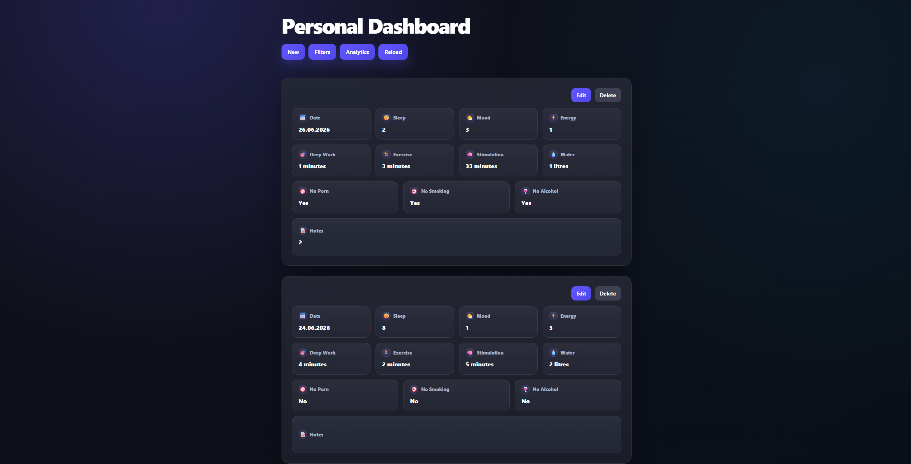

# Personal Data Dashboard

A full-stack web application for recording daily wellbeing, productivity, and lifestyle data.

The dashboard allows users to create, update, delete, filter, and analyse daily entries containing information such as sleep, mood, energy, focused work, exercise, stimulation, water intake, notes, and lifestyle habits.

The project was built with **FastAPI**, **SQLAlchemy**, **Pydantic**, **SQLite**, and **React with Vite**.

## Project Status

**Version 1.0 — complete**

The core application, automated tests, validation, analytics, and responsive user interface are implemented.

---

## Preview




---

## Main Features

- Create a daily entry
- Edit an existing entry
- Delete an entry
- Retrieve entries by ID or date
- Display entries in reverse chronological order
- Filter entries using custom date ranges
- Use preset date filters
- View analytics for a selected period
- View a summary of the last seven days
- Track custom lifestyle habit flags
- Add optional notes to each entry
- Validate data on both the frontend and backend
- Handle duplicate dates and invalid requests
- Display loading, empty, and error states
- Use the dashboard on different screen sizes
- Run automated unit, database integration, and API tests

---

## Personal Experience and Lessons Learned

### Why I Built It

I chose this project as my first full-stack application because I was not fully satisfied with the habit-tracking tools currently available. I wanted to create a customizable dashboard tailored to my own needs that could continue developing alongside me.

### Main Challenges

When I started the project, I had limited experience with APIs, databases, and web development. However, I enjoy learning new technologies, so this did not stop me from building the application step by step.

Another challenge was moving away from C++, which is the main programming language I use at university. Working with Python, FastAPI, JavaScript, and React required me to adjust to different programming patterns and development workflows.

### What I Learned

The most demanding part was learning the entire technology stack from frontend to backend. Most of the technologies used in this project were new to me, so I had to learn them while actively building the application.

During the project, I learned how to:

- design and implement REST API endpoints,
- connect a React frontend to a FastAPI backend,
- model and query data using SQLAlchemy,
- validate requests using Pydantic,
- separate routing, database, schema, and service responsibilities,
- write unit, database integration, and API integration tests,
- debug issues across multiple application layers,
- plan and complete a larger project incrementally.

### What I Am Most Proud Of

I am especially proud of the automated tests. Because of my engineering background, testing and verifying expected behaviour felt natural to me.

I also enjoyed building the analytics and calculation logic. Solving these problems felt similar to working through programming puzzles, which is one of my favourite parts of software development.

### What I Would Do Differently

My biggest mistake was beginning the project without a clearly defined final scope. This sometimes caused me to spend too much time improving individual parts instead of working toward a specific finished version.

In my next project, I would define a smaller and more precise goal before writing code, divide the work into milestones, and decide in advance which features belong in the first release.

## Tracked Data

Each daily entry can contain:

| Field | Description |
|---|---|
| Date | Date represented by the entry |
| Sleep | Number of hours slept |
| Mood | Mood rating from 1 to 10 |
| Energy | Energy rating from 1 to 10 |
| Deep work | Minutes of focused work |
| Exercise | Minutes of physical activity |
| Stimulation | Minutes spent on stimulating activities |
| Water intake | Litres of water consumed |
| Notes | Optional text notes |
| Lifestyle habits | Custom daily boolean habit flags |

Most metrics are optional, allowing partially completed entries.

---

## Analytics

The application calculates:

- number of tracked days,
- average sleep,
- average mood,
- average energy,
- total and average deep-work time,
- total and average exercise time,
- total and average stimulation time,
- average water intake,
- number of clean habit days,
- best mood day,
- worst mood day.

Analytics can be calculated for all records or limited to a selected date range.

---

## Technology Stack

### Backend

- Python
- FastAPI
- SQLAlchemy
- Pydantic
- SQLite
- Uvicorn

### Frontend

- React
- Vite
- JavaScript
- Fetch API
- React Icons
- CSS

### Testing

- pytest
- FastAPI TestClient
- Isolated SQLite test database
- Unit tests
- Database integration tests
- API integration tests

### Development Tools

- Git and GitHub
- Python virtual environment
- Node.js and npm
- Visual Studio Code

---

## Architecture

The application uses a separated frontend and backend architecture:

```text
React frontend
      │
      │ HTTP / JSON
      ▼
FastAPI routes
      │
      ▼
Service layer
      │
      ▼
SQLAlchemy
      │
      ▼
SQLite database
```

Backend responsibilities are divided between:

- **routes** — HTTP request and response handling,
- **schemas** — request validation and response structure,
- **models** — database table definitions,
- **services** — reusable analytics and query logic,
- **database configuration** — engine and session management.

---

## Project Structure

```text
personal-data-dashboard/
│
├── app/
│   ├── main.py                 # FastAPI application and API routes
│   ├── db.py                   # Database engine and session setup
│   ├── models.py               # SQLAlchemy database models
│   ├── schemas.py              # Pydantic validation schemas
│   └── services.py             # Queries and analytics calculations
│
├── frontend/
│   ├── src/
│   │   ├── App.jsx             # Main React application
│   │   ├── App.css             # Dashboard styling
│   │   └── main.jsx            # React entry point
│   ├── package.json
│   └── vite.config.js
│
├── tests/
│   ├── conftest.py             # Shared database and API test fixtures
│   ├── test_api.py             # API integration tests
│   ├── test_database_services.py
│   └── test_services.py        # Analytics unit tests
│
├── requirements.txt
├── start-dev.bat               # Windows development startup script
└── README.md
```

Generated databases, virtual environments, cache files, build output, and installed frontend packages are not committed to the repository.

---

## API Endpoints

Interactive API documentation is available while the backend is running:

```text
http://127.0.0.1:8001/docs
```

### General

| Method | Endpoint | Description |
|---|---|---|
| `GET` | `/` | Check whether the API is running |

### Entries

| Method | Endpoint | Description |
|---|---|---|
| `POST` | `/api/entries/` | Create a daily entry |
| `GET` | `/api/entries` | Retrieve entries |
| `GET` | `/api/entries/{entry_id}` | Retrieve an entry by ID |
| `PATCH` | `/api/entries/{entry_id}` | Update an entry by ID |
| `DELETE` | `/api/entries/{entry_id}` | Delete an entry by ID |
| `GET` | `/api/entries/date/{entry_date}` | Retrieve an entry by date |
| `PATCH` | `/api/entries/date/{entry_date}` | Update an entry by date |
| `DELETE` | `/api/entries/date/{entry_date}` | Delete an entry by date |

The entries endpoint accepts optional query parameters:

```text
GET /api/entries?start_date=2026-07-01&end_date=2026-07-31
```

### Analytics

| Method | Endpoint | Description |
|---|---|---|
| `GET` | `/api/analytics` | Return analytics for an optional date range |
| `GET` | `/api/entries/summary/7days` | Return a summary of the last seven days |

Example analytics request:

```text
GET /api/analytics?start_date=2026-07-01&end_date=2026-07-31
```

---

## Validation

Backend validation is implemented with Pydantic.

| Field | Accepted value |
|---|---|
| Sleep hours | `0–14` |
| Mood | `1–10` |
| Energy | `1–10` |
| Deep-work minutes | `0–600` |
| Exercise minutes | `0–300` |
| Stimulation minutes | `0–600` |
| Water intake | `0–10` litres |
| Notes | Maximum 500 characters |

Additional behaviour includes:

- only one entry can exist for a particular date,
- invalid request data returns an HTTP `422` response,
- duplicate dates return an HTTP `400` response,
- missing entries return an HTTP `404` response,
- a start date after an end date returns an HTTP `400` response.

---

## Installation

### Prerequisites

Install:

- Python
- Node.js and npm
- Git

### 1. Clone the repository

```bash
git clone https://github.com/orzeljabol/personal-data-dashboard.git
cd personal-data-dashboard
```

### 2. Create a Python virtual environment

```bash
python -m venv .venv
```

Activate it on Windows:

```powershell
.\.venv\Scripts\Activate.ps1
```

Activate it on Linux or macOS:

```bash
source .venv/bin/activate
```

### 3. Install backend dependencies

```bash
python -m pip install -r requirements.txt
```

### 4. Start the backend

```bash
uvicorn app.main:app --reload --port 8001
```

The backend will be available at:

```text
http://127.0.0.1:8001
```

### 5. Install frontend dependencies

Open another terminal:

```bash
cd frontend
npm install
```

### 6. Start the frontend

```bash
npm run dev
```

The frontend will normally be available at:

```text
http://localhost:5173
```

---

## Windows Quick Start

After completing the initial installation, Windows users can start the development environment with:

```powershell
.\start-dev.bat
```

The script:

- opens the project in Visual Studio Code,
- starts the FastAPI backend on port `8001`,
- starts the Vite frontend development server.

---

## Running Tests

Activate the Python virtual environment and run:

```bash
python -m pytest -v
```

The test suite includes:

### Unit tests

Tests for:

- totals,
- averages,
- missing values,
- empty datasets,
- clean-day calculations,
- best and worst mood days,
- complete analytics summaries.

### Database integration tests

Tests for:

- inserting SQLAlchemy models,
- querying an isolated test database,
- inclusive date-range filtering,
- result ordering,
- empty query results.

### API integration tests

Tests for:

- successful entry creation,
- retrieving created entries,
- duplicate-date rejection,
- invalid-data rejection,
- empty database responses,
- descending date ordering,
- analytics responses.

The test suite uses a separate SQLite database and does not modify the application's normal data.

---

## Frontend Production Build

To verify that the frontend can be built successfully:

```bash
cd frontend
npm run build
```

The generated production files will be placed in the frontend build directory.

---

## Current Scope

This version is designed as a single-user personal dashboard.

Version 1 does not include:

- authentication,
- multiple user accounts,
- cloud data synchronisation,
- a hosted production database,
- data sharing between users.

These limitations are intentional and keep the first version focused on data tracking, CRUD functionality, analytics, testing, and frontend-backend integration.

---

## Future Improvements

Possible future development includes:

- user authentication,
- PostgreSQL support,
- interactive trend charts,
- CSV or JSON data export,
- automated CI testing with GitHub Actions,
- production deployment,
- multiple user accounts,
- configurable metrics and habit categories.

---

## Author

Developed by [orzeljabol](https://github.com/orzeljabol).